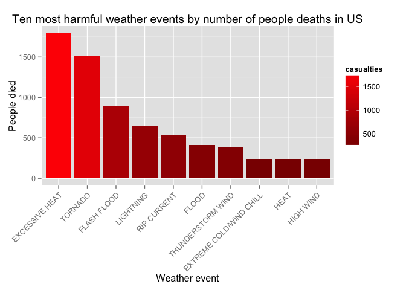
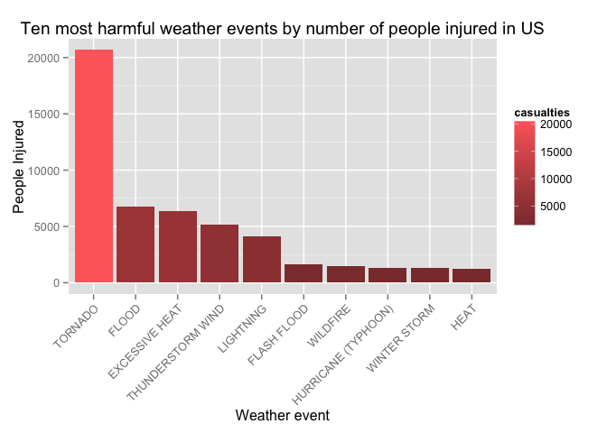
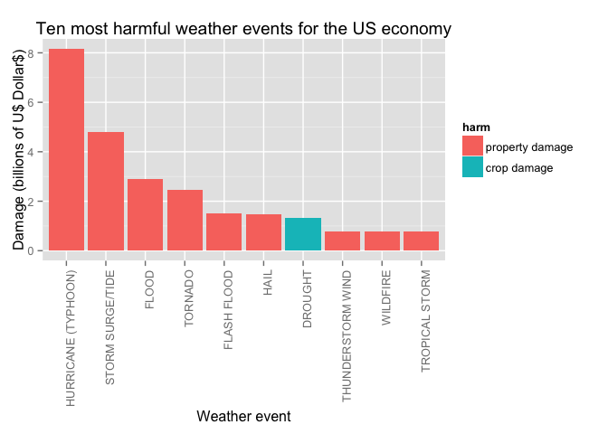

# The impact of storms and severe weather events on economy and population health in USA
Evgeniy Zabrodskiy  


## Synopsis
The goal of the analysis is to find the most harmful weather events with respect to population health and to understand which weather events have the most negative impact on the economy. This analyisis is based on the data from the NOAA Storm Database Event about severe weather events in the United States.  

There are two main sections in the document:  
**- Data Processing** guides through transformations of the RAW data that are needed to perform the analysis;  
**- Results** summarizes the analysis with plots and conclusions.


## Data Processing
This section describes all the steps taken to prepare the RAW data for further analysis.  

### Reading data


```r
# read.csv can open csv files from bz2 directly
storms <- read.csv("repdata-data-StormData.csv.bz2")
```

### Cleaning data
Quick look at the data shows that it needs tidying. Also it is clear that not all the columns are needed from this dataset to answer the questions of this analysis, sosome transformations will be performed and  described below.

First of all, only part of the dataset should be used for this analysis for several reasons:  
- According to [Storm Events Database description](http://www.ncdc.noaa.gov/stormevents/details.jsp) there are three distinct periods when data reporting changed significantly.  
For the analysis only third period will be selected which started in January 1996 and contains data for 48 event types recorded as defined in NWS Directive 10-1605. If we decided to use the complete dataset, results of the analysis may be significantly biased due to major differences in the number and types of events reported during mentioned periods.  
- We need only events which led to **fatalities** or **injuries** to answer first question.  
- We need only events which caused **property damage** or **crop damage**.  

In order to get the subset of the data, based on date, BGN_DATE should be converted to Date format. Then events which began later than January, 1996 can be selected.


```r
storms <- transform(storms, BGN_DATE = as.Date(as.character(BGN_DATE), "%m/%d/%Y"))
storms1996 <- subset(storms, BGN_DATE >= as.Date("1996-01-01"))
```

Select events with either fatalities or injuries or property damage or crop damage.

```r
selected <- subset(storms1996, FATALITIES > 0 | INJURIES > 0 | PROPDMG > 0 | CROPDMG > 0)
```

There is a known duplicate with REFNUM == 605943 in the dataset with errorneous damage value modifier ("B" in PROPDMGEXP) which should be removed. It duplicates REFNUM == 567251 which has correct damage value modifier ("M" in PROPDMGEXP):

```r
selected[selected$REFNUM == 605943, c("BGN_DATE",
                                      "COUNTYNAME", 
                                      "STATE", 
                                      "EVTYPE", 
                                      "PROPDMG", 
                                      "PROPDMGEXP", 
                                      "CROPDMG", 
                                      "CROPDMGEXP",
                                      "REMARKS")]
```

```
##          BGN_DATE COUNTYNAME STATE EVTYPE PROPDMG PROPDMGEXP CROPDMG
## 605953 2006-01-01       NAPA    CA  FLOOD     115          B    32.5
##        CROPDMGEXP
## 605953          M
##                                                                                                                                                                                                                                                                                                                                                                                               REMARKS
## 605953 Major flooding continued into the early hours of January 1st, before the Napa River finally fell below flood stage and the water receeded. Flooding was severe in Downtown Napa from the Napa Creek and the City and Parks Department was hit with $6 million in damage alone. The City of Napa had 600 homes with moderate damage, 150 damaged businesses with costs of at least $70 million.
```

The record about the same event with correct PROPDMGEXP modifier:

```r
selected[selected$REFNUM == 567221, c("BGN_DATE",
                                      "COUNTYNAME", 
                                      "STATE", 
                                      "EVTYPE", 
                                      "PROPDMG", 
                                      "PROPDMGEXP", 
                                      "CROPDMG", 
                                      "CROPDMGEXP",
                                      "REMARKS")]
```

```
##          BGN_DATE COUNTYNAME STATE EVTYPE PROPDMG PROPDMGEXP CROPDMG
## 567251 2005-12-31       NAPA    CA  FLOOD     115          M    32.5
##        CROPDMGEXP
## 567251          M
##                                                                                                                                                                                                                                                                                                                                                                                                                                                                                                                          REMARKS
## 567251 Severe Flooding occurred as the Napa River exceeded flood stage at both St.Helena and in the City of Napa. The Napa Creek in downtown Napa also flooded, damaging the entire business district. City and Parks Department in Napa was hit with $6 million in damage alone. The City of Napa had 600 homes with moderate damage, 150 damaged businesses with costs of at least $70 million. More than 5 inches of rain fell on Napa in less than 24 hours. The flooding continued into the first few days of January 2006.
```

Remove the duplicate which contains the mistake:

```r
selected <- selected[!selected$REFNUM == 605943, ]
```

It is necessary to calculate damage value using the same base. In order to do this we need to multiply PROPDMG and CROPDMG based on PROPDMGEXP and CROPDMGEXP modifiers.  
Take a look at damage values modifiers:

```r
table(selected$PROPDMGEXP)
```

```
## 
##             +      -      0      1      2      3      4      5      6 
##   8448      0      0      0      0      0      0      0      0      0 
##      7      8      ?      B      H      K      M      h      m 
##      0      0      0     31      0 185474   7364      0      0
```

```r
table(selected$CROPDMGEXP)
```

```
## 
##             0      2      ?      B      K      M      k      m 
## 102767      0      0      0      2  96787   1761      0      0
```

Only "K", "M", and "B" are used and they stand for one thousand, one million and one billion.  

Adjust damage values using PROPDMGEXP and CROPDMGEXP modifiers.

```r
selected$PROPDMG[selected$PROPDMGEXP == "K"] <- 
    selected$PROPDMG[selected$PROPDMGEXP == "K"] * 1000
selected$PROPDMG[selected$PROPDMGEXP == "M"] <- 
    selected$PROPDMG[selected$PROPDMGEXP == "M"] * 1000000
selected$PROPDMG[selected$PROPDMGEXP == "B"] <- 
    selected$PROPDMG[selected$PROPDMGEXP == "B"] * 1000000000

selected$CROPDMG[selected$CROPDMGEXP == "K"] <- 
    selected$CROPDMG[selected$CROPDMGEXP == "K"] * 1000
selected$CROPDMG[selected$CROPDMGEXP == "M"] <- 
    selected$CROPDMG[selected$CROPDMGEXP == "M"] * 1000000
selected$CROPDMG[selected$CROPDMGEXP == "B"] <- 
    selected$CROPDMG[selected$CROPDMGEXP == "B"] * 1000000000
```

Next step is to remove unused levels of EVTYPE. Using subsetting we reduced the number of distinct EVTYPES and we need to adjust levels.  

```r
# adjust levels and make them uppercase
selected$EVTYPE <- factor(toupper(as.character(selected$EVTYPE)))
```

Even after subsetting and removing unused event types, there is a huge number of weather events compared to expected 48 events listed in [NWS Directive 10-1605](http://www.ncdc.noaa.gov/stormevents/pd01016005curr.pdf)  
This means that EVTYPE values need to be corrected.  

Many event names in the dataset have the following defects:  
- short versions of the official event names  
- names with addidional suffixes  
- names with spaces in inappropriate places  
- combined events  
- names made up with no reference to official event names  

Events from the official document *NWS Directive 10-1605*:   

```r
events <- c("Astronomical Low Tide", "Avalanche", "Blizzard", "Coastal Flood", "Cold/Wind Chill", "Debris Flow", "Dense Fog", "Dense Smoke", "Drought", "Dust Devil", "Dust Storm", "Excessive Heat", "Extreme Cold/Wind Chill", "Flash Flood", "Flood", "Frost/Freeze", "Funnel Cloud", "Freezing Fog", "Hail", "Heat", "Heavy Rain", "Heavy Snow", "High Surf", "High Wind", "Hurricane (Typhoon)", "Ice Storm", "Lake-Effect Snow", "Lakeshore Flood", "Lightning", "Marine Hail", "Marine High Wind", "Marine Strong Wind", "Marine Thunderstorm Wind", "Rip Current", "Seiche", "Sleet", "Storm Surge/Tide", "Strong Wind", "Thunderstorm Wind", "Tornado", "Tropical Depression", "Tropical Storm", "Tsunami", "Volcanic Ash", "Waterspout", "Wildfire", "Winter Storm", "Winter Weather")

# make upper-case version of event names
eventsUC <- toupper(events)
```

This data is not used in the analysis directly but it was needed at the exploratory phase, so it is kept in the document for reference.

Many weather events have very little impact on the results of the analysis as it was discovered at the exploratory data analysis phase and those event names are kept as is.   
This section modifies event names to match the ones from the official document for some of the events that contain values that may have impact on the result of this analysis.  

```r
levels(selected$EVTYPE)[grep("TSTM WIND", 
                             as.character(levels(selected$EVTYPE)))] <- "THUNDERSTORM WIND"
levels(selected$EVTYPE)[grep("RIP CURRENTS", 
                             as.character(levels(selected$EVTYPE)))] <- "RIP CURRENT"
levels(selected$EVTYPE)[grep("EXTREME COLD", 
                             as.character(levels(selected$EVTYPE)))] <- "EXTREME COLD/WIND CHILL"
levels(selected$EVTYPE)[grep("^FOG", 
                             as.character(levels(selected$EVTYPE)))] <- "DENSE FOG"
levels(selected$EVTYPE)[grep("HURRICANE/TYPHOON", 
                             as.character(levels(selected$EVTYPE)))] <- "HURRICANE (TYPHOON)"
levels(selected$EVTYPE)[grep("WILD/FOREST FIRE", 
                             as.character(levels(selected$EVTYPE)))] <- "WILDFIRE"
levels(selected$EVTYPE)[grep("HURRICANE$", 
                             as.character(levels(selected$EVTYPE)))] <- "HURRICANE (TYPHOON)"
levels(selected$EVTYPE)[grep("STORM SURGE", 
                             as.character(levels(selected$EVTYPE)))] <- "STORM SURGE/TIDE"
levels(selected$EVTYPE)[grep("TYPHOON", 
                             as.character(levels(selected$EVTYPE)))] <- "HURRICANE (TYPHOON)"
levels(selected$EVTYPE)[grep("FREEZE", 
                             as.character(levels(selected$EVTYPE)))] <- "FROST/FREEZE"
```

Make new data structures to address both questions of the analysis:

```r
fatalities <- tapply(selected$FATALITIES, selected$EVTYPE, sum)
injuries <- tapply(selected$INJURIES, selected$EVTYPE, sum)
propdamage <- tapply(selected$PROPDMG, selected$EVTYPE, sum)
cropdamage <- tapply(selected$CROPDMG, selected$EVTYPE, sum)
```

Since we're interested in the most harmful event types, we order the totals and select only top 10 harmful events.

```r
fatalities <- fatalities[order(-fatalities)]
injuries <- injuries[order(-injuries)]
propdamage <- propdamage[order(-propdamage)]
cropdamage <- cropdamage[order(-cropdamage)]

# create data.frame with the results for convinient plotting
fatalities.df.top10 <- data.frame(casualties = as.vector(fatalities[1:10]), 
                       event = as.factor(names(fatalities[1:10])), 
                       harm = "fatality")

# reorder levels for ordered barplot
fatalities.df.top10$event <- factor(fatalities.df.top10$event, levels = fatalities.df.top10$event)

injuries.df.top10 <- data.frame(casualties = as.vector(injuries[1:10]), 
                         event = as.factor(names(injuries[1:10])), 
                         harm = "injury")

# reorder levels for ordered barplot
injuries.df.top10$event <- factor(injuries.df.top10$event, levels = injuries.df.top10$event)

# economy-related data
propdamage.df <- data.frame(damage = as.vector(propdamage), 
                       event = as.factor(names(propdamage)), 
                       harm = "property damage")

cropdamage.df <- data.frame(damage = as.vector(cropdamage), 
                         event = as.factor(names(cropdamage)), 
                         harm = "crop damage")

economyharm.df <- rbind(propdamage.df, cropdamage.df)
# top 10
economyharm.df <- economyharm.df[order(-economyharm.df$damage), ]
economyharm.df.top10 <- economyharm.df[1:10, ]

# reorder levels for ordered barplot
economyharm.df.top10$event <- factor(economyharm.df.top10$event, levels = economyharm.df.top10$event)
```

## Results
The result of the analysis shows the most harmful weather events in United States from January 1996 to November 2011 answering two questions:  
1. Which types of events are most harmful with respect to population health?  
2. Which types of events have the greatest economic consequences?

The barplot below shows ten most harmful weather events (x-axis) with the corresponding number of deaths (y-axis).  

```r
fatalities.low = min(fatalities.df.top10$casualties) 
fatalities.high = max(fatalities.df.top10$casualties)

qplot(event, 
      casualties, 
      data = fatalities.df.top10, 
      geom = "bar", 
      stat = "identity", 
      fill = casualties,
      xlab = "Weather event",
      ylab = "People died",
      main = "Ten most harmful weather events by number of people deaths in US") +
    theme(axis.text.x=element_text(angle = 45, hjust = 1)) +
    scale_fill_continuous(low="red4", high="red1", limits=c(fatalities.low, fatalities.high))
```

 

The barplot below shows ten most harmful weather events (x-axis) with the corresponding number of injuries (y-axis).  

```r
injuries.low = min(injuries.df.top10$casualties) 
injuries.high = max(injuries.df.top10$casualties)

qplot(event, 
      casualties, 
      data = injuries.df.top10, 
      geom = "bar", 
      stat = "identity", 
      fill = casualties,
      xlab = "Weather event",
      ylab = "People Injured",
      main = "Ten most harmful weather events by number of people injured in US") + 
    theme(axis.text.x=element_text(angle = 45, hjust = 1)) +
    scale_fill_continuous(low="indianred4", high="indianred1", limits=c(injuries.low, injuries.high))
```

 

The barplot below shows which types of events (x-axis) have the greatest economic consequences. Damage is estimated in billions of dollars (y-axis).

```r
qplot(event, 
      damage/10e+9,    # convert to billions
      data = economyharm.df.top10, 
      geom = "bar", 
      stat = "identity",
      position = "dodge",
      fill = harm,
      xlab = "Weather event",
      ylab = "Damage (billions of U$ Dollar$)",
      main = "Ten most harmful weather events for the US economy") + 
    theme(axis.text.x=element_text(angle = 90, hjust = 1))
```

 

As can be seen from the plots, the population suffers mostly from:
**Exessive Heat**, **Tornado**, **Floods**, **Lightning**, **RIP Currents** and **Thunderstorm Wind** which often lead to *deaths*.
Almost the same list of weather events cause a lot of *injuries* (except for the **RIP Currents** which makes sense). It is worth mentioning that **Tornado** seems to be the most dangerous weather event.  

Looking at the damage value estimations, the list of weather events looks different:  
The most harmful is **Hurricane (Typhoon)** followed by **Storm Surge/Tide**, **Floods**, **Tornado**, **Hail** and the only event that does *crop damage* comparable to *property damage* is **Drought**.
